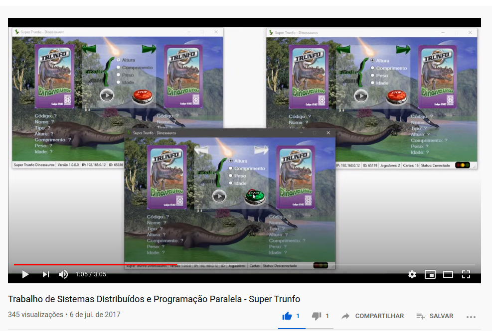

# Super Trunfo

>
>Trabalho de Sistemas Distribuídos e Programação Paralela - INF0213A (UCS - Universidade de Caxias do Sul)
>

**Alunos:** Rafael Rossa; Lucas Santos; 
**Instituição:** Universidade de Caxias do Sul 
**Curso:** Bacharelado em Ciência da Computação 
**Disciplina:** Sistemas Distribuídos e Programação Paralela 
**Professor:** André Luiz Martinotto 
**Implementado em C#**

**Fórum: <a href="https://bomrafinha.dev/sistemas-distribuidos-super-trunfo/" target="_blank">https://bomrafinha.dev/sistemas-distribuidos-super-trunfo/</a>**  

***Clique na Imagem para visualizar o vídeo***  

## Jogo de Super Trunfo

### Objetivo do Trabalho

O objetivo desse trabalho consiste na implementação distribuída de um jogo de cartas chamado Super Trunfo. A implementação deverá ser desenvolvida utilizando Sockets e deverá suportar de 2 a 8 jogadores. O tema do jogo poderá ser escolhido pelo grupo.

### Observações:
- Linguagens permitidas: Java, C#, C/C++, Python
- Grupos de no máximo dois alunos
- Trabalhos iguais serão zerados.
- Data de entrega e apresentação: 07/07/2017

### Super Trunfo (Fonte: Wikipedia)

Super Trunfo é um jogo de cartas distribuído no Brasil pela Grow, que consiste em tomar todas as cartas dos outros participantes por meio de escolhas de características de cada carta (exemplo:  velocidade, altura, longevidade). O jogo comporta de dois a oito participantes.
Tradicionalmente, estão em disputa 32 cartas, divididas em oito  grupos de quatro cartas (1A-1D, 2A-2D, … 8A-8D), sendo que uma delas é a carta "Super Trunfo", que ao entrar em disputa pode ser invocada para tomar as outras cartas na mão dos oponentes. O jogo começou a ser produzido no Brasil nos anos 70, voltado a automóveis e outros veículos, e se popularizou nos anos 80. Atualmente conta com vários temas, entre os tradicionais sobre carros e aviões até os mais novos como Cães de Raça e de super-heróis.
Regras do Jogo (Fonte: Grow Jogos e Brinquedos S. A.) O jogo comporta de dois a oito participantes e tem como objetivo ficar com todas as cartas do baralho. As cartas são distribuídas em número igual para cada um dos jogadores. Cada jogador formará seu monte e só poderá ver a primeira carta da pilha. (As cartas possuem uma série de informações, tais como: Potência, Km/h,
etc. e com essas informações que cada um vai jogar). Inicia o jogo quem estiver à esquerda do jogador que distribuiu as cartas
Se você é o primeiro a jogar, escolha, dentre as informações contidas em sua carta, aquela que você julga ser capaz de superar a que se encontra nas cartas que seus adversários têm em mãos, Por exemplo: você escolhe a informação potência. Imediatamente todos os outros jogadores abaixam a primeira carta de suas pilhas e conferem o valor da informação. Quem tiver o valor mais alto, ganha as cartas da mesa e coloca as embaixo de sua pilha. O próximo a jogar será o que venceu a jogada anterior. Assim prossegue o jogo, até que um dos participantes fique com todas as cartas do baralho, vencendo a partida. Se dois ou mais jogadores abaixarem cartas com o mesmo valor máximo, os demais participantes deixam suas cartas na mesa e os que empataram decidem a vitória. Para isso, aquele que cantou inicialmente dirá  um novo item de sua próxima carta, e quem tiver o valor mais alto, ganha todas as cartas da rodada.
A carta SUPER TRUNFO é embaralhada com as demais. Seus dados técnicos superam todos os dados de cartas marcadas com B/C/D. Assim, se você tiver uma carta SUPER TRUNFO, sua chance de ganhar de seus adversários è muito grande. Você só vai perder se um deles lhe apresentar uma carta marcada com A (1A, 2A, 3A, 4A, etc. 

 

## Créditos 
[@bomrafinha](https://github.com/bomrafinha)

## [Licença](./LICENSE) 
